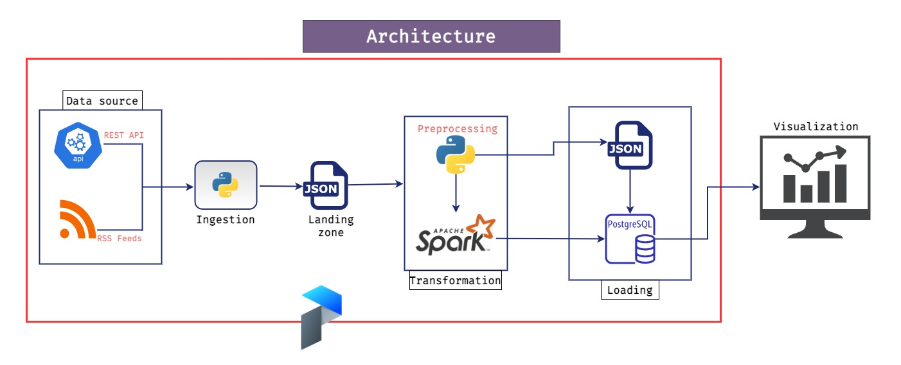

# ETL Project (Batch/Local Edition)

> PS: This is a work in progress

## Architecture diagram

## Extraction

Raw data is extracted from sources and saved as `json` file before any further processing. This will ensure that we still have access to the data in case we want to perform additional analysis or loss of data. There are two categories of data collected.

### Extracting Data from Job Postings

I extracted data from job listing websites (Adzuna, Remotive) using their respective REST APIs endpoints and RSS feeds (Stackoverflow jobs).

### Extracting Data from Github Trends

Github trending repositories data is scrapped using Python `requests` library with `BeautifulSoup`.

## Transformation

### Pre-processing

Initially extracted data is pre-processed. Since the websites have different field names in their API responses, I ensure the data followed a common type/format in terms of the fields.

### Final Transformation

## Loading

> Data Model

## Tech Stack

- `Python3`
- `Prefect`